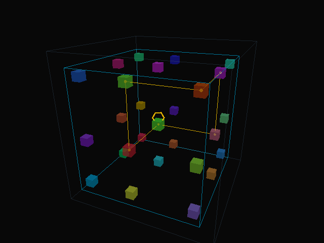

# CubeClosure

**心慌方·闭合 — A Mathematically Closed Reconstruction of the Cube Movie's Room System**

<p align="center">
      
</p>

---

## Introduction / 项目简介

**CubeClosure** mathematically proves and interactively visualizes the closed room-moving system from the 1997 movie *Cube* (directed by Vincenzo Natali). The project constructs a valid 26-axis codebook, verifies permutation closure under all room moves, and provides a real-time 3D web visualization for exploration.

**CubeClosure** 对 1997 年电影《心慌方》(*Cube*，导演 Vincenzo Natali）中的房间移动系统进行了数学建模与闭合性证明，并提供交互式 3D 网页可视化，让用户实时探索整个系统的运作方式。项目构造了一组合法的 26 轴编码本，并验证了所有房间移动操作下排列组合的闭合性。

## Key Features / 主要特性

- **Mathematical proof of closure** — constructs a valid codebook and proves the room-moving permutation group is closed
- **26-axis encoding** — each room is assigned a coordinate on all 26 movement axes (6 face + 12 edge + 8 vertex)
- **GIF animation** — the Python script generates an animated GIF showing room movements over time
- **Interactive 3D visualization** — a browser-based Three.js scene lets you rotate, zoom, and step through moves
- **Bilingual documentation** — Chinese and English throughout

## Quick Start / 快速开始

### Web Visualization / 网页可视化

```bash
cd web
python -m http.server
```

Then open `http://localhost:8000` in your browser.

### Python Script / Python 脚本

```bash
pip install matplotlib
python cube_closed_system.py
```

This generates the codebook CSV and a GIF animation.

## Math Overview / 数学概述

Each room is encoded with three integers `(a, b, c)` drawn from the codebook. The core invariants are:

| Symbol | Definition |
|--------|------------|
| `S = a + b + c` | encoding sum (constant per axis) |
| `p1 = 2a + c` | position index 1 |
| `p2 = 2a + b` | position index 2 |

A codebook is **valid** when, for every coordinate `S = 1..n`, the mappings `S → p1` and `S → p2` each form a permutation of `{1..n}`. This ensures all rooms move without collision across all three phases.

Not all grid sizes admit valid codebooks. Known results:

| Grid size | Valid codebook exists? |
|-----------|----------------------|
| 3         | Yes                  |
| 4         | No                   |
| 5         | Yes                  |
| 6         | Yes                  |
| 7         | No                   |
| 8         | Yes                  |

## Project Structure / 项目结构

```
CubeClosure/
├── cube_closed_system.py            # Python: codebook solver, proof, GIF export
├── cube_axis_codebook_26.csv        # generated 26-axis codebook
├── cube_closed_system_notes_zh.md   # detailed math & engineering notes (Chinese)
├── cube_closed_system_notes_en.md   # detailed math & engineering notes (English)
├── web/
│   ├── index.html                   # entry point for the 3D visualization
│   ├── css/
│   │   └── style.css                # dark cinematic theme
│   ├── js/
│   │   ├── codebook.js              # math model: codebook, permutations, states
│   │   ├── scene.js                 # Three.js scene: rooms, grid, camera
│   │   ├── animation.js             # phase transition animation with lerp
│   │   ├── ui.js                    # control panel, info panel, event binding
│   │   └── i18n.js                  # bilingual support (中文 / English)
│   └── lib/                         # local Three.js (no CDN dependency)
│       ├── three.module.js
│       └── controls/
│           └── OrbitControls.js
├── README.md
├── LICENSE
└── .gitignore
```

## Tech Stack / 技术栈

- **Python 3** — Matplotlib (codebook generation, proof, GIF export)
- **Three.js r170** — 3D rendering in the browser
- **Pure HTML / CSS / JS** — no build tools, no frameworks, no dependencies to install

## License / 许可证

This project is licensed under the [MIT License](LICENSE).

## Credits / 致谢

Inspired by *Cube* (1997), directed by Vincenzo Natali.
